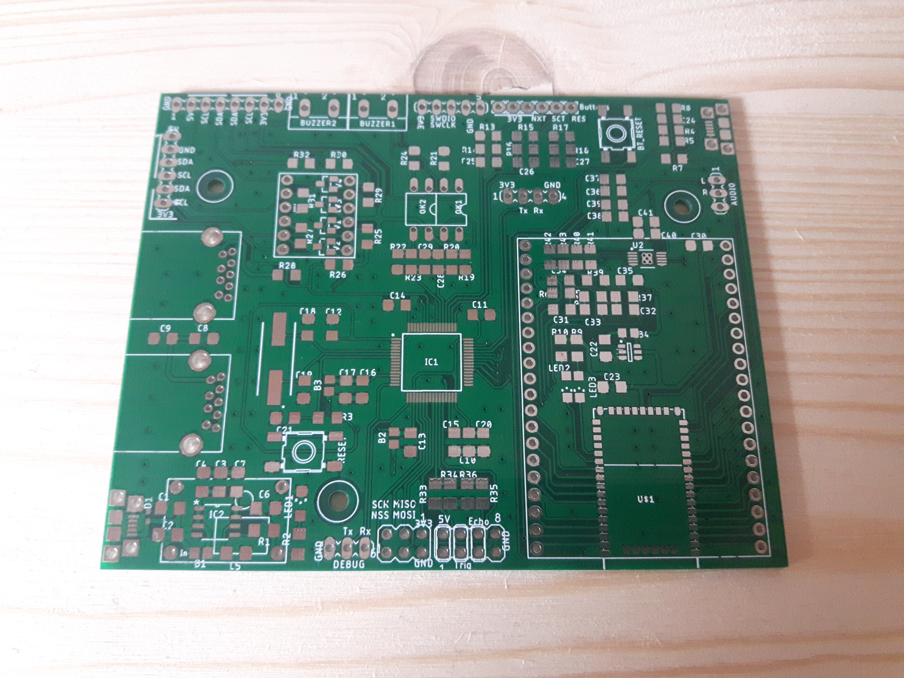
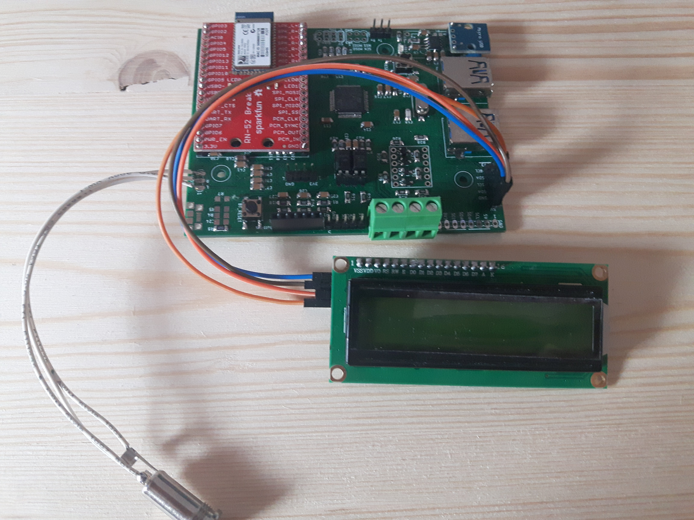

# FF-Stopwatch-Hardware
This Repo contains the hardware layout of the FF-Stopwatch project. The project
has been designed in EAGLE

## Folderstructure
| ..  
|-- doc      &nbsp;&nbsp;&nbsp;&nbsp;&nbsp;&nbsp;&nbsp;&nbsp;&nbsp; < contains docoumentation  
|-- Lib      &nbsp;&nbsp;&nbsp;&nbsp;&nbsp;&nbsp;&nbsp;&nbsp;&nbsp;&nbsp; < Eagle library files  
|-- schematic   < schematic and layout (eagle)  
|-- images   &nbsp;&nbsp;&nbsp;&nbsp; < images of the layout

### bare board

### assembled board
